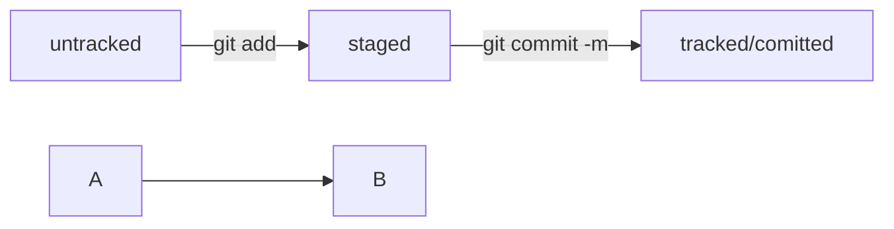

# **Небольшой справочник по Git**

## *__Навигация__*  
- *pwd* - печать текущей директории  
- *cd* - сменить текущую директорию  
- *cd ~* - возврат в домашнюю директорию  
- *cd ..* - возврат на директорию выше  
- *ls* - список файлов  
- *touch* - создать файл  
- *mkdir* - создать директорию  
- *cp file copy* - копировать файл  
- *mv* - перемещение  
- *rm, rm -r* - удаление, рекурсивное удаление  
----------------------------------------------
## *_Git_*  
- *git init* - делаем текущую директорию гит репозиторием  
- *rm -rf .git* - разкомитить  
- *git add --all - добавления изменений в рабочем каталоге в индекс  
- *git commit -m* 'Сообщение'* - добавляем коммит  
- *git log* - история коммитов  
----------------------------------------------

